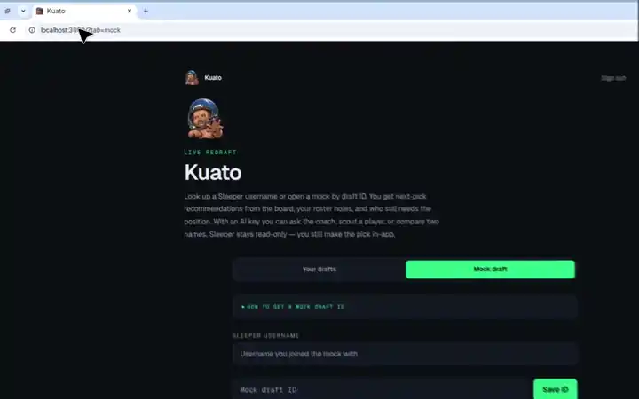

# Kuato


Password-gated Next.js app for live [Sleeper](https://sleeper.com/) redraft rooms. It ranks remaining players from ADP, roster holes, demand, news, and nflverse stats. It cannot make picks. Auction drafts and dynasty leagues are out of scope.

## Live draft



GitHub autoplays this WebP. Source clip: [`docs/live-room.mp4`](docs/live-room.mp4).

## Features

**Access**

- Shared password on `/login`
- **Your drafts** — Sleeper username loads in-progress redraft rooms
- **Mock draft** — paste a Sleeper mock ID, keep a username for seat, reuse saved IDs
- `/debug` redirects to the mock tab

**Live room**

- Clock: pick number, round, who is on the clock, picks until you
- News strip from ESPN RSS (injuries, transactions, rumors)
- Top 5 remaining with ADP, ADP gap vs the current pick, and why they rank there
- Your roster (filled from your picks, including Sleeper mocks that omit `roster_id`)
- Recent picks
- Remaining board: ADP, bye, last-year production; search by name; filter by position

**Recommendation scoring**

- Fantasy Football Calculator ADP
- Starter-hole need vs league roster settings (QB / RB / WR / TE / FLEX / K / DEF)
- Upcoming-pick demand at the same position
- Tier cliffs when the next ADP drop is steep
- QB / skill stacks on your roster
- Injury flags from Sleeper
- Last-season nflverse production (PPR, rushing, targets)
- Snap share and depth-chart rank (rookies skip the low-snap penalty)
- Bye-week clustering

**AI coach** (needs `OPENAI_API_KEY` or `ANTHROPIC_API_KEY`)

- On-the-clock note when it is your pick
- **Ask** — free-form question about the remaining board
- **Scout** — one remaining player
- **Compare** — two remaining players
- **Review roster** — holes and next-pick plan
- **News briefing** — ESPN items mapped onto remaining names
- **Sleepers & fades** — ADP gaps on the remaining board
- **Injury analysis** — Sleeper injury flags on your roster and remaining players

The coach is optional. Rankings still run without a model key.

## How to use

1. Sign in with the shared password.
2. Open **Your drafts** and enter a Sleeper username, or **Mock draft** with a mock ID (and username so Kuato can find your seat).
3. Open a room. The board polls Sleeper while the draft is live.

## Run locally

Node.js 20+ and npm.

```bash
git clone https://github.com/cbdonohue/kuato.git
cd kuato
npm ci
cp .env.example .env.local
```

Set `SITE_PASSWORD` in `.env.local`. Add `OPENAI_API_KEY` or `ANTHROPIC_API_KEY` if you want the coach.

```bash
npm run dev
```

Open [http://localhost:3000](http://localhost:3000).

| Variable | Required | What it does |
| --- | --- | --- |
| `SITE_PASSWORD` | yes | Shared login |
| `OPENAI_API_KEY` | no | OpenAI coach |
| `ANTHROPIC_API_KEY` | no | Anthropic coach |
| `AI_MODEL` | no | Override the default model id |

## Tests

```bash
npm test
npm run test:coverage
```

Coverage must stay at 80% or higher. CI runs lint, typecheck, and coverage on every pull request.

## Docs and contributing

- [Architecture](docs/architecture.md) — how a live room is assembled
- [Changelog](CHANGELOG.md)
- [Contributing](CONTRIBUTING.md)
- [Code of conduct](CODE_OF_CONDUCT.md)
- [Security](SECURITY.md)

MIT. See [LICENSE](LICENSE).
