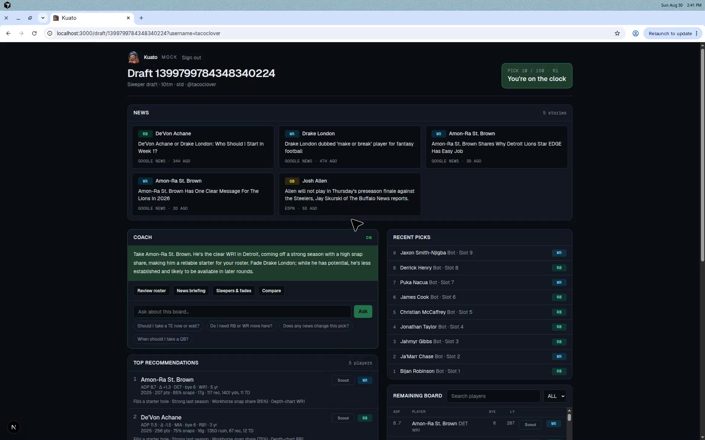
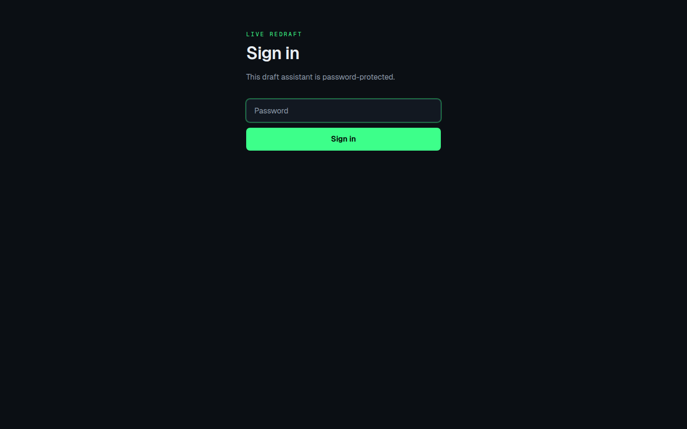
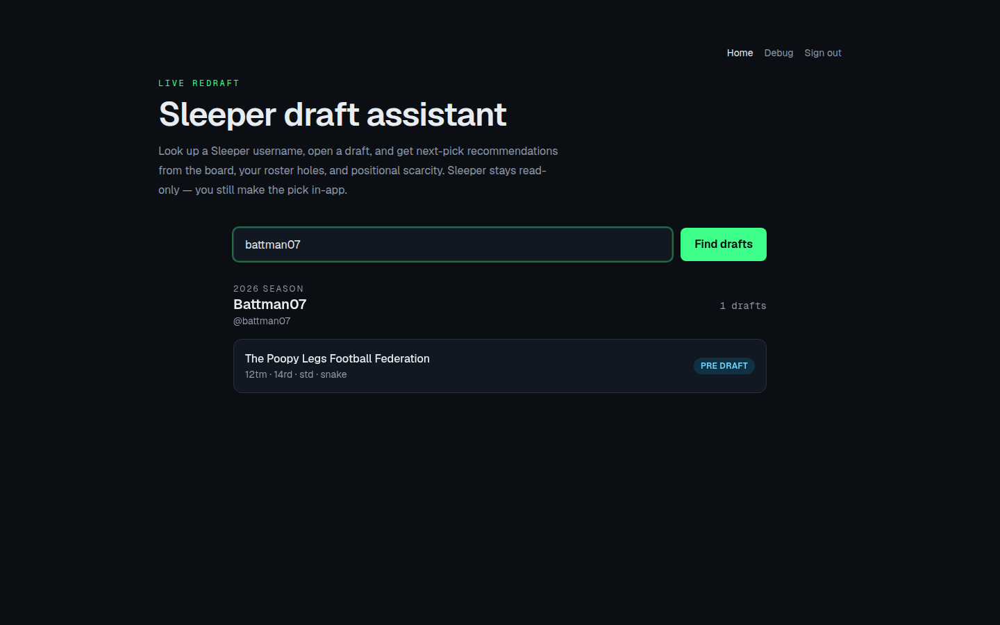
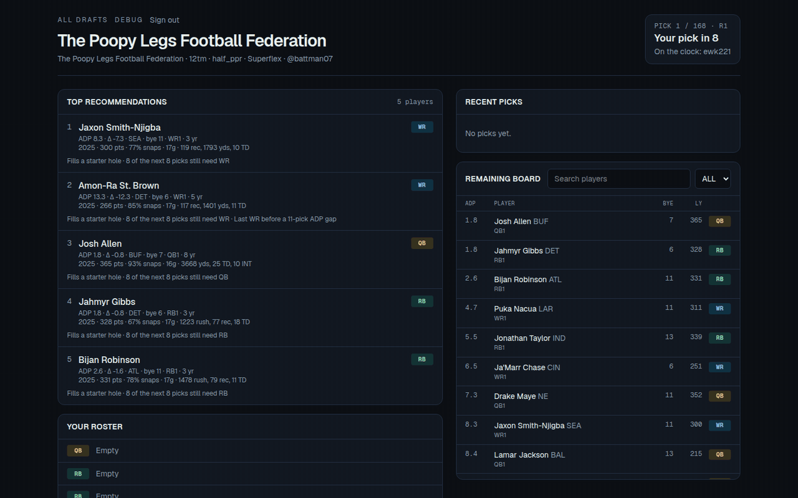

# Kuato

Password-gated live redraft pick recommendations for a [Sleeper](https://sleeper.com) username. Look up your drafts, open a room, and get a top-5 board from Fantasy Football Calculator ADP vs pick number, your roster holes, who still needs the position before you pick, ADP tier cliffs, and same-team stacks.

Sleeper's API is read-only. This app cannot make picks. Auction drafts and dynasty leagues are unsupported.

[](https://github.com/cbdonohue/kuato/actions/workflows/test.yml)
[](LICENSE)
[](https://nodejs.org)



## Features

- **Your drafts** — look up a Sleeper username and open any of this season's rooms
- **Mock draft** — paste a Sleeper mock ID (the old `/debug` route redirects here)
- **Top-5 board** — ADP vs pick, starter holes, upcoming positional demand, tier cliffs, stacks, injury, last-season production, snap share, depth-chart role, and stacked byes
- **Remaining board** — filter by position or search a name
- **News strip** — recent headlines for the current recs
- **Optional AI coach** — Ask, Scout, Compare, roster review, news briefing, and sleepers / fades when an API key is set

## Screenshots

Sign in with the shared site password, then pick **Your drafts** or **Mock draft**:





The remaining board lists ADP, name, bye, and last-season points:



## Run

```bash
npm ci
cp .env.example .env.local
```

Set `SITE_PASSWORD` in `.env.local`. Then:

```bash
npm run dev
```

Open [http://localhost:3000](http://localhost:3000), sign in, and look up a username or mock ID.

| Variable | Required | Purpose |
| --- | --- | --- |
| `SITE_PASSWORD` | yes | Shared password for the whole app |
| `OPENAI_API_KEY` | no | Coach tools via OpenAI (`gpt-4o-mini`) |
| `ANTHROPIC_API_KEY` | no | Coach tools via Anthropic if OpenAI is unset (`claude-3-5-haiku-latest`) |

Without an AI key you still get the top-5 and reasons. Production is a normal Next.js host: set the same variables, run `npm run build` and `npm start`.

## How the top-5 is scored

Each remaining player gets a weighted total in `src/lib/recommend.ts`:

| Signal | What it captures |
| --- | --- |
| ADP vs pick | Value relative to the current pick; wide ADP spread shrinks huge reaches |
| Roster need | Starter holes, with Superflex treating QB as a skill seat |
| Upcoming demand | How many of the next managers still need that position |
| Tier cliff | Last player before an ADP gap |
| Stack | Same-team pairing with a player already on your roster |
| Production / snaps / depth | Last-season nflverse points, snap share, and depth-chart role |
| Bye clusters | Penalty when the player shares a bye with your other starters |
| Injury | Status from Sleeper |

Sleeper `search_rank` is the fallback when a player has no FFC ADP. Rankings are not FantasyPros. Kickers and DST stay off the board until the last two rounds.

## Data

- [Sleeper](https://docs.sleeper.com/) public API for drafts, picks, and players
- [Fantasy Football Calculator](https://fantasyfootballcalculator.com) ADP (free with attribution; cached about once a day)
- [nflverse](https://github.com/nflverse) last-season stats and snap share (CC-BY 4.0)
- [ESPN](https://www.espn.com) unofficial player news and [Google News](https://news.google.com) RSS for top-5 rec headlines (cached about 30 minutes)

ADP format follows the league: PPR / half-PPR / standard, or 2QB when the roster has Superflex.

## Optional AI coach

When `OPENAI_API_KEY` or `ANTHROPIC_API_KEY` is set, the live room adds:

- A 2–3 sentence pick note when you are on the clock or within two picks
- **Ask** — freeform questions about this board, with suggested prompts from your holes
- **Scout** — a fit / risk / take-now note for any remaining player
- **Compare** — head-to-head for two players on this roster
- **Review roster** — holes, bye clusters, and the next-pick plan
- **News briefing** and **Sleepers & fades** from the current recs and remaining ADP board

## Tests

```bash
npm test
npm run lint
npm run typecheck
npm run test:coverage
```

Coverage must stay at 80% or higher (statements, branches, functions, and lines). CI runs lint, typecheck, and coverage on every pull request to `master`.

## Docs

- [Contributing](CONTRIBUTING.md)
- [Architecture](docs/architecture.md)
- [Security](SECURITY.md)
- [Code of Conduct](CODE_OF_CONDUCT.md)
- [Changelog](CHANGELOG.md)

## License

[MIT](LICENSE)

Not affiliated with Sleeper, Fantasy Football Calculator, nflverse, ESPN, OpenAI, or Anthropic. Recommendations are decision support, not a guarantee.
